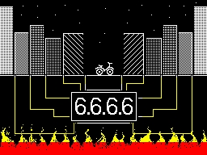
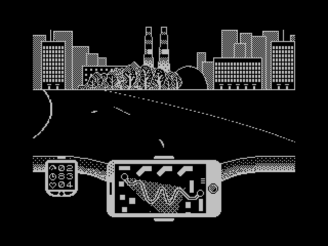

# 6.6.6.6

This is the second attempt to make a game for ZX Spectrum.

Long-long ago, between the world of darkness and the world of living people,
it was built - a line of defense, a trap for dark forces. The Net.
But from the blows of the creatures of darkness, cracks are already scattering across it.
If the defenses collapse, the world will end. The only hope is to repair the cliffs
and restore the fallen areas before the entire Network collapses.

But who can handle this task?

You?

The hero of the game is a rookie in the army of Light, protecting the sparkling The Net
from the intrigues of the Dark Forces, a fighter against darkness and chaos,
a technical support employee who first went to work. evil, restart the routers,
and turn off and then turn on the frozen equipment. Each task consists of two stages:
a bike ride, where you need to overcome a winding path in the allotted time,
and the answer to a question, with a choice of one of three options.
Five attempts, and the attempt is wasted both in the wrong answer to the question
and in the fall from the bike.

Let the Evil tremble! Our hero is already close!

P.S. Beware of puddles on the road. "




## Prerequisities

1. [nodejs and npm](https://nodejs.org/en/download/) because assets preparing scripts written in JavaScript.
2. bin2c
3. [zmakebas](https://github.com/z00m128/zmakebas)
4. cmake
5. [sdcc](http://sdcc.sourceforge.net/)
6. [Fuse emulator](http://fuse-emulator.sourceforge.net/)

## Building

### Prepare assets

In a project root directory:
```
./assets.h
```

### Compile binary

In a project root directory:
```
mkdir build
cd build
cmake ..
make
```

### Compose tape file

In a project root directory:
```
./maketape.sh build
```
This will create tape file sixsixsixsix.tap in a project root directory.

## Playing

In a project root directory:
```
./emulate.sh
```